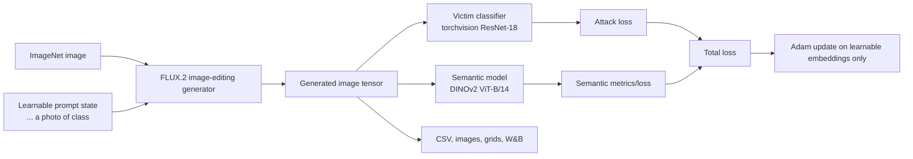

# prompt_attack

Last updated: 2026-05-21 KST

This repository studies learnable prompt-token attacks against ImageNet classifiers through
FLUX.2 image editing. The goal is not to hand-write adversarial prompts. The goal is to optimize
small textual-inversion-style tokens in the generator conditioning path so that the generated image
stays natural while the victim classifier changes its prediction.

## Current Method

The current implementation uses real tokenizer tokens, not direct `prompt_embeds` prepending.

For each input image and class label, the attack creates a prompt like:

```text
<v1> <v2> ... <vN> a photo of {class_label}
```

The FLUX.2 adapter then:

1. Adds `<v1> ... <vN>` to the FLUX.2 tokenizer idempotently.
2. Resizes the text encoder token embedding matrix if new tokens were added.
3. Initializes the learnable token embeddings from the mean embedding of `object` plus noise.
4. Keeps the FLUX.2 model weights frozen.
5. Registers a temporary forward hook on the text encoder input embedding layer.
6. Replaces only the `<v*>` embedding outputs with a small `torch.nn.Parameter`.
7. Runs the pipeline through the normal `prompt=` tokenizer/text-encoder path.
8. Optimizes only the learnable token embeddings.
9. Syncs the learned values back into the text encoder token rows after optimizer steps.

The old direct `prompt_embeds` path has been removed.

## Pipeline



## Loss Names

Use these objective names in `attack.objective`:

| Objective | Meaning | Total loss behavior |
| --- | --- | --- |
| `cr` | Classification rejection only | Uses only CR; DINO is logged as a metric but not optimized. |
| `cr_dino` | Classification rejection with DINO preservation | Uses `(1 - lambda_sem) * CR + lambda_sem * DINO_loss`. |
| `negative_cross_entropy` | Legacy alias for CR-style untargeted attack | Still supported for compatibility. |
| `untargeted_margin` | Legacy margin objective | Minimizes true logit minus best other logit. |

CR is currently implemented as negative cross entropy:

```text
CR = -CE(victim_logits, true_label)
```

The optimizer minimizes the loss, so minimizing `-CE` increases the true-label cross entropy and
pushes the victim classifier away from the correct class.

`lambda_sem` must be in `[0, 1]`. For `cr`, `lambda_sem` is ignored by the training loss and the
effective weights are:

```text
attack_loss_weight = 1.0
semantic_loss_weight = 0.0
```

For `cr_dino`, the effective weights are:

```text
attack_loss_weight = 1.0 - lambda_sem
semantic_loss_weight = lambda_sem
```

## Repository Map

```text
configs/
  flux2_resnet18.yaml          Main current config: 64 tokens, objective=cr.
  flux2_resnet18_nodino.yaml   Smaller CR-only config: 16 tokens.

dataset/
  images.csv                   CSV metadata when class_mode=csv_images.
  images/                      Image files referenced by images.csv.

docker/
  Dockerfile
  docker-compose.yml           CUDA service with repository and dataset mounts.

scripts/
  run_attack.py                Main experiment entry point.
  smoke_test.py                Mock/real generator smoke test entry point.
  time_attack.py               Tiny timing run for real generator path.
  select_imagenet_subset.py    Dataset helper.

src/prompt_attack/
  attacks/losses.py            CR, CR+DINO, legacy loss dispatch.
  attacks/runner.py            End-to-end image-by-image attack loop.
  attacks/soft_tokens.py       Prompt/token text helpers.
  config.py                    YAML config dataclasses and loader.
  data/imagenet.py             ImageNet/CSV image record loading.
  generators/base.py           LearnablePrompt and generator protocol.
  generators/flux2.py          FLUX.2 textual-inversion-token adapter.
  generators/mock.py           Differentiable mock generator for tests.
  metrics/                     FID, IQA, image distance, summary metrics.
  models/                      Victim classifier and DINOv2 semantic model.
  utils/wandb_logger.py        W&B scalar/image/table logging.

tests/
  test_soft_tokens.py          Token prompt, hook, and gradient tests.
  test_losses.py               Loss dispatch and weight behavior tests.
  test_wandb_logger.py         W&B naming behavior test.
```

## Environment

The main environment is Docker with CUDA. Host and container paths used in this workspace:

```text
Host repository:     D:\code\promtp_attack
Container repo:     /workspace/promtp_attack
Host dataset mount: E:\ImageNet
Container dataset:  /data/imagenet
```

Start the service from the repository root:

```powershell
docker compose -f docker\docker-compose.yml up -d --build prompt-attack
```

Run commands inside the running container:

```powershell
docker exec -w /workspace/promtp_attack promtp_attack-prompt-attack-1 pytest
docker exec -w /workspace/promtp_attack promtp_attack-prompt-attack-1 ruff check src tests scripts configs
docker exec -w /workspace/promtp_attack promtp_attack-prompt-attack-1 mypy src scripts tests
```

`docker/.env` is read by Docker Compose and should contain local secrets/config such as:

```text
WANDB_API_KEY=...
WANDB_MODE=online
WANDB_PROJECT=prompt-soft-token-attack
WANDB_ENTITY=
HF_TOKEN=
IMAGENET_HOST_ROOT=E:/ImageNet
```

Do not commit `docker/.env`.

### B200 uv Environment

B200 does not use Docker for this project. Use the repository checkout at:

```text
/NHNHOME/WORKSPACE/0226010134_A/daeyun/prompt_attack
```

The ImageNet folder root on B200 is:

```text
/NHNHOME/WORKSPACE/0226010134_A/data/ImageNet/2012
```

Set up and verify the uv environment:

```bash
cd /NHNHOME/WORKSPACE/0226010134_A/daeyun/prompt_attack
uv venv --python 3.12 .venv
uv sync --extra dev --extra cuda128
uv run python -c "import torch; print(torch.__version__, torch.cuda.is_available(), torch.cuda.get_device_name(0))"
uv run python scripts/check_imagenet_dataset.py --root /NHNHOME/WORKSPACE/0226010134_A/data/ImageNet/2012
```

Run with the same config by overriding only the dataset root:

```bash
PROMPT_ATTACK_IMAGENET_ROOT=/NHNHOME/WORKSPACE/0226010134_A/data/ImageNet/2012 \
  uv run python scripts/run_attack.py --config configs/flux2_resnet18.yaml --device cuda --max-images 3
```

## Dataset Mode

The current main config uses:

```yaml
data:
  imagenet_root: /data/imagenet
  split: train
  class_mode: imagenet_folder
```

With `class_mode: imagenet_folder`, the loader expects ImageNet-1K folder splits:

```text
/data/imagenet/train/{synset}/*.JPEG
/data/imagenet/val/{synset}/*.JPEG
```

The Docker compose file maps `${IMAGENET_HOST_ROOT:-E:/ImageNet}` to `/data/imagenet:ro`.
Non-Docker environments can override the YAML path with `PROMPT_ATTACK_IMAGENET_ROOT`.
`E:\ImageNet` has been checked as an ImageNet-1K folder dataset: 1000 train class dirs, 1000 val
class dirs, 1,281,167 train images, 50,000 val images, no zero-byte files, matching synsets, and
successful val decode verification.

The runner can still load `csv_images` datasets for NIPS2017-style CSV experiments. In that mode,
the loader expects `images.csv` with `ImageId,TrueLabel` and an `images/{ImageId}.png` directory.

Dataset verification:

```powershell
python scripts\check_imagenet_dataset.py --root E:\ImageNet
python scripts\check_imagenet_dataset.py --root E:\ImageNet --verify-images sample --sample-size 10000
```

## Main Commands

Run the current 3-image CR experiment:

```powershell
docker exec -w /workspace/promtp_attack promtp_attack-prompt-attack-1 `
  python scripts/run_attack.py --config configs/flux2_resnet18.yaml --device cuda --max-images 3
```

Run a mock-generator smoke test:

```powershell
docker exec -w /workspace/promtp_attack promtp_attack-prompt-attack-1 `
  python scripts/smoke_test.py --config configs/flux2_resnet18.yaml --device cuda --max-images 2
```

Run a tiny real-generator timing test:

```powershell
docker exec -w /workspace/promtp_attack promtp_attack-prompt-attack-1 `
  python scripts/time_attack.py --config configs/flux2_resnet18.yaml --device cuda `
  --max-images 1 --steps 2 --height 512 --width 512 --num-inference-steps 2 --no-cpu-offload
```

## Outputs

Each run writes under `output.root` from the config.

For the current main config:

```text
outputs/flux2_klein_4b_cr_gs1_steps100_tokens64_max3/
  images/{class_label}/{image_id}/original.png
  images/{class_label}/{image_id}/adv.png
  grids/{class_label}_{image_id}.png
  metrics/results.csv
  metrics/summary.json
```

Important CSV fields:

```text
prompt_text
num_soft_tokens
soft_token_initializer
learnable_token_texts
objective
lambda_sem
attack_loss_weight
semantic_loss_weight
success
semantic_constrained_success
clean_true_conf
adv_true_conf
confidence_drop
dino_similarity
ssim
best_step
best_attack_step
best_semantic_success_step
first_success_step
first_semantic_success_step
runtime_seconds
```

W&B logs step scalars, per-image summaries, image pairs, and an `image_results/table` when enabled.
The config name now takes precedence over a stale `WANDB_NAME` environment variable.

## Current Default Config

`configs/flux2_resnet18.yaml` currently represents the main continuation point:

```yaml
data:
  imagenet_root: /data/imagenet
  split: train
  class_mode: imagenet_folder

generator:
  name: flux2_klein_4b
  model_id: black-forest-labs/FLUX.2-klein-4B
  height: 512
  width: 512
  guidance_scale: 1.0
  num_inference_steps: 4

victim:
  name: resnet18
  weights: IMAGENET1K_V1

semantic:
  name: dinov2_vitb14

attack:
  num_soft_tokens: 64
  soft_token_initializer: object
  soft_token_init_std: 0.02
  lr: 1.0e-2
  lr_scheduler:
    name: cosine
    warmup_steps: 5
    min_lr: 1.0e-4
  steps: 100
  lambda_sem: 0.0
  semantic_threshold: 0.85
  objective: cr
```

Notes:

- `guidance_scale` is set to `1.0`. Earlier FLUX.2 Klein runs indicated that guidance can be
  ignored for step-wise distilled behavior, so do not treat guidance-scale ablations as reliable
  unless the backend behavior is verified.
- `num_inference_steps` is `4` for runtime control. Higher values are more expensive and did not
  become the default.
- `num_soft_tokens` is `64` in the current main config because it is a high-capacity attack setting.
  It is also more prone to semantic collapse than 16 or 32 tokens.

## Experiment Notes So Far

These are small 3-image exploratory runs, not statistically conclusive results. They are useful for
orienting the next experiments.

| Setting | ASR | Semantic ASR | Mean DINO | FID | Note |
| --- | ---: | ---: | ---: | ---: | --- |
| 16 tokens, legacy CR+DINO style | 2/3 | 2/3 | 0.910 | 67.31 | Best semantic preservation among tested token counts. |
| 32 tokens, legacy CR+DINO style | 1/3 | 1/3 | 0.935 | 50.44 | Conservative, high semantic similarity. |
| 64 tokens, legacy CR+DINO style | 3/3 | 0/3 | 0.100 | 494.62 | Strong attack but severe semantic collapse. |
| 64 tokens, weighted lambda=0.5 | 1/3 | 0/3 | 0.774 | 116.55 | Better preservation, weaker attack. |
| 64 tokens, weighted lambda=0.7 | 3/3 | 1/3 | 0.612 | 309.37 | More attack success but lower preservation. |
| 64 tokens, weighted lambda=0.9 | 2/3 | 0/3 | 0.586 | 235.32 | Still not monotonic because init is not controlled. |

Important interpretation:

- Larger token counts increase attack capacity but can push the generator away from the original
  semantics.
- `lambda_sem` behavior has not been monotonic. One likely reason is that the learnable token
  initialization is not yet seeded, so different lambda runs may start from different prompt
  embeddings.
- The current final image is selected by minimum total loss. If a semantic-constrained success
  happened at an earlier step, the saved final image may still be a later non-semantic candidate.

## Known Limitations

1. Learnable-token initialization is not fully reproducible yet.
   Generation uses a stable image seed, but `torch.randn_like` for token init is not currently seeded
   per image/config. This makes lambda/token-count comparisons noisy.

2. Final selection is coupled to the optimization loss.
   The runner tracks `best_semantic_success_step`, but the saved image is still chosen by `best`
   total loss. This can under-report useful semantic-constrained candidates.

3. CR and DINO losses have different scales.
   CR is negative CE and can have a much larger magnitude than `1 - DINO_similarity`. Even with
   weighted loss, CR may dominate. A bounded or normalized CR objective may be needed.

4. 64 tokens can overfit the generator conditioning space.
   It often finds attacks, but semantic quality can collapse. Use 16 or 32 tokens as stability
   baselines.

5. Prompt length is finite.
   FLUX.2 prompt handling has a finite text sequence length. The tested 16, 32, and 64 token counts
   are safe; much larger token counts should be tested carefully for truncation.

## Recommended Next Work

The highest-value next changes are architectural, not just hyperparameter sweeps:

1. Add a `CandidateArchive`.
   Store every step candidate with attack, semantic, confidence, and image-quality metrics.

2. Add a separate `FinalSelector`.
   Recommended selection priority:
   - semantic-constrained success with best attack margin
   - otherwise attack success with highest DINO similarity
   - otherwise lowest true-class confidence
   - otherwise lowest total loss

3. Seed learnable-token initialization.
   Use a deterministic seed based on image ID, token count, objective, lambda, and init candidate.
   Log `init_seed` in CSV and W&B.

4. Add multi-start initialization search.
   Run 8-16 init seeds for 10-20 warmup steps, score them, then continue only the top 2-4.

5. Add more initializer types.
   Useful candidates:
   - `object`
   - `class_label`
   - `photo_object`
   - neutral-token average such as `object thing item image`
   - random vocabulary embedding average

6. Consider bounded CR for `cr_dino`.
   For example, normalize or clamp CR so DINO loss has predictable influence.

7. Try progressive token capacity.
   Start from 16 tokens, expand to 32 after plateau, then optionally 64. Use lower LR for old tokens
   and higher LR for newly introduced tokens.

## Validation Checklist

Before pushing code changes, run:

```powershell
docker exec -w /workspace/promtp_attack promtp_attack-prompt-attack-1 pytest
docker exec -w /workspace/promtp_attack promtp_attack-prompt-attack-1 ruff check src tests scripts configs
docker exec -w /workspace/promtp_attack promtp_attack-prompt-attack-1 mypy src scripts tests
```

Recent validation state before this README update:

```text
pytest: 18 passed
ruff: all checks passed
mypy: success, no issues in 36 source files
```

## Handoff Summary For Another AI

Continue from `configs/flux2_resnet18.yaml`.

Do not reintroduce direct `prompt_embeds`; the current design intentionally uses real tokenizer
tokens and a text-encoder embedding hook. Use `cr` for CR-only runs and `cr_dino` for CR plus DINO.

For the next meaningful experiment, implement deterministic init seeds and a final selector before
running large sweeps. Without those, ASR and semantic ASR comparisons can be misleading because
different runs may start from different learnable-token initializations and may save non-semantic
candidates even when a semantic candidate existed during optimization.
